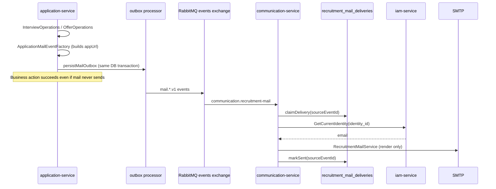

# Recruitment Mail Events

Transactional interview and offer emails are delivered through a dedicated mail integration flow that runs in parallel with in-app `notifications.*` events.

## Design decisions (locked)

| Decision | Choice |
|----------|--------|
| RabbitMQ queue | **One shared queue:** `communication.recruitment-mail` |
| Routing | Bind exact routing keys for the 4 mail events (not `notifications.#`) |
| FE URLs (`appUrl`) | **Built in `application-service`** and included in event payload |
| Recipient email | Resolved in `communication-service` via IAM gRPC only (no shared DB) |
| Mail idempotency | `recruitment_mail_deliveries` table keyed by `sourceEventId` |
| Business vs mail | Interview create / offer send **commit even if mail later fails** |

## Flow

## Event names

| Event | Trigger | Notification | Mail |
|-------|---------|--------------|------|
| `mail.interview-created.v1` | Employer creates interview | `notifications.interview-scheduled.v1` | Yes |
| `mail.interview-updated.v1` | Employer updates interview **and slot changed** | `notifications.interview-status-changed.v1` | Yes (slot only) |
| `mail.interview-cancelled.v1` | Employer cancels interview | `notifications.interview-status-changed.v1` | Yes |
| `mail.offer-sent.v1` | Employer sends offer | `notifications.offer-sent.v1` | Yes |

**Update interview rule:** in-app notification is always emitted on update; mail is emitted **only when `slotChanged === true`**.

Payloads are defined in `packages/contracts/src/events/mail/recruitment-mail.event.ts`. Each payload includes a final `appUrl` (e.g. `{APP_BASE_URL}/candidate/interviews/{id}`) built by `application-service`.

Recipient email is **not** in the event payload.

## Mail delivery idempotency

Table: `recruitment_mail_deliveries`

| Column | Purpose |
|--------|---------|
| `source_event_id` | Unique idempotency key (from event payload) |
| `status` | `claimed` → `sent` or `failed` |
| `claimed_at` | Active processing lease; see stale-claim rule below |
| `sent_at` | Set after SMTP success |
| `failed_at` / `last_error` | Set when retries exhausted or config error |

Consumer contract:

1. `claimDelivery(sourceEventId)` before IAM lookup / SMTP
2. Skip with metric `duplicate` if already `sent`, or if another worker holds a **fresh** `claimed` lease (`claimed_at` within `MAIL_DELIVERY_CLAIM_TIMEOUT_MS`)
3. **Stale-claim reclaim:** if status is `claimed` but `claimed_at` is older than `MAIL_DELIVERY_CLAIM_TIMEOUT_MS`, a different worker **must** be allowed to reclaim the delivery and continue processing (covers crash/hang after claim, before `markSent`)
4. `markSent(sourceEventId)` after SMTP success, then `ack`
5. `clearClaim(sourceEventId)` before scheduling retry
6. `markFailed(sourceEventId)` when retries are exhausted

This prevents duplicate emails when RabbitMQ redelivers after a successful send but before `ack`.

## IAM lookup contract

`communication-service` resolves email via **gRPC only**:

- RPC: `IamService.GetCurrentIdentity`
- Input: `identity_id` = `recipientIdentityId` from event payload
- Output: `email`

No direct IAM database access. If a narrower internal RPC is added later (e.g. `GetIdentityEmailById`), it must remain service-to-service over gRPC.

## application-service configuration

| Variable | Purpose |
|----------|---------|
| `APP_BASE_URL` | Builds final candidate interview/offer URLs placed in mail event payload |
| `GRPC_JOB_URL` | Resolves `jobTitle` and `companyName` via `ListJobsByIds` |

## communication-service configuration

| Variable | Purpose |
|----------|---------|
| `GRPC_IAM_URL` | IAM gRPC target for email lookup |
| `MAIL_HOST` / `MAIL_PORT` / `MAIL_USER` / `MAIL_PASSWORD` | SMTP |
| `MAIL_SECURE` | SMTP TLS |
| `MAIL_FROM_ADDRESS` / `MAIL_FROM_NAME` | Sender |
| `MAIL_DELIVERY_CLAIM_TIMEOUT_MS` | Stale `claimed` lease recovery (default `60000`) |
| `MAIL_INTERVIEW_MAX_RETRIES` | Interview mail consumer retries (default `3`) |
| `MAIL_OFFER_MAX_RETRIES` | Offer mail consumer retries (default `3`) |

## RabbitMQ topology

- Exchange: `events`
- Queue: `communication.recruitment-mail` (single shared recruitment mail queue)
- Routing keys (exact bind):
  - `mail.interview-created.v1`
  - `mail.interview-updated.v1`
  - `mail.interview-cancelled.v1`
  - `mail.offer-sent.v1`
- DLQ: parking DLQ via `BROKER_DEAD_LETTER_ENABLED=true`

## Failure semantics

- **Create interview / send offer / cancel interview** succeed in `application-service` when the business write + outbox persist commit.
- Mail delivery is an **eventual side effect**. SMTP or IAM failures do **not** roll back the business transaction.
- Retries and DLQ apply only to the mail consumer path.

## Parity notes

Mail copy is ported from monolith `mail.service.ts`:

- Interview create: `CareerHub interview invitation`
- Interview slot update: `CareerHub interview schedule updated`
- Interview cancel: `CareerHub interview cancelled`
- Offer send: `CareerHub job offer received`

In-app `notifications.*` events are unchanged.
