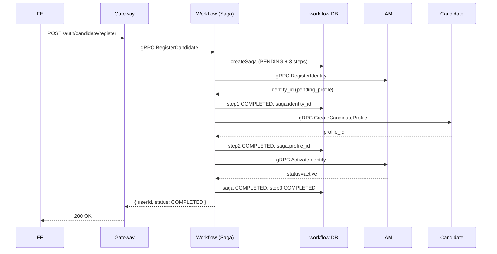
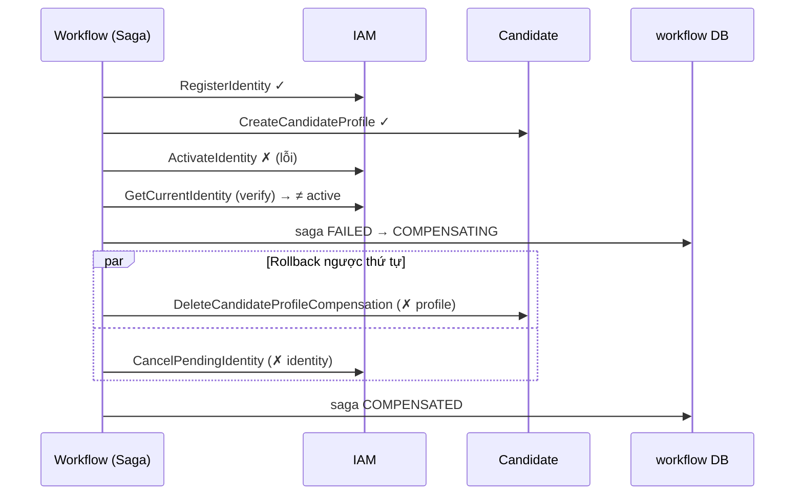

# Saga Đăng Ký — Giải Thích Sâu Step-by-Step

> Tài liệu này mổ xẻ **toàn bộ luồng Saga đăng ký** (candidate & employer) trong `workflow-service`: chạy qua code nào, gọi service nào (gRPC), cập nhật DB ra sao ở từng bước, rollback/compensation hoạt động thế nào, và recovery khi service chết giữa chừng.
>
> Đọc kèm: [huong-dan-toan-bo-luong-microservice.md §8](./huong-dan-toan-bo-luong-microservice.md#8-saga--điều-phối-giao-dịch-phân-tán) (tổng quan) và cách demo ở cuối tài liệu này.

## Mục lục
1. [Vì sao đăng ký cần Saga](#1-vì-sao-đăng-ký-cần-saga)
2. [Bản đồ file & vai trò](#2-bản-đồ-file--vai-trò)
3. [Mô hình trạng thái & bảng DB](#3-mô-hình-trạng-thái--bảng-db)
4. [Chuỗi kích hoạt: FE → Gateway → Workflow](#4-chuỗi-kích-hoạt-fe--gateway--workflow)
5. [HAPPY PATH — từng bước kèm code & DB](#5-happy-path--từng-bước-kèm-code--db)
6. [ROLLBACK / COMPENSATION — chi tiết](#6-rollback--compensation--chi-tiết)
7. [RECOVERY — phục hồi saga kẹt](#7-recovery--phục-hồi-saga-kẹt)
8. [IDEMPOTENCY theo requestId](#8-idempotency-theo-requestid)
9. [Bảng tổng hợp: bước → gRPC → DB](#9-bảng-tổng-hợp-bước--grpc--db)
10. [Sequence diagram](#10-sequence-diagram)
11. [Cách chạy & quan sát](#11-cách-chạy--quan-sát)

---

## 1. Vì sao đăng ký cần Saga

Đăng ký một ứng viên cần **3 thay đổi state nằm ở 2 service khác nhau**, mỗi service một database riêng → **không thể dùng 1 transaction ACID**:

1. **IAM** tạo identity (trạng thái `pending_profile`).
2. **Candidate** (hoặc **Employer**) tạo hồ sơ.
3. **IAM** kích hoạt identity (`active`).

Nếu bước 2 hoặc 3 thất bại, ta phải **hoàn tác (compensate)** những bước đã thành công để không để lại "rác" (identity treo, hồ sơ mồ côi). Đó chính là bài toán **Saga theo kiểu orchestration**: có **1 orchestrator** (workflow-service) điều khiển tuần tự các bước qua gRPC, ghi lại tiến trình vào DB, và tự rollback khi lỗi.

---

## 2. Bản đồ file & vai trò

| File | Vai trò |
|---|---|
| [services/gateway/.../auth.controller.ts](../services/gateway/src/presentation/http/auth/auth.controller.ts) | Nhận `POST /auth/candidate/register`, kiểm `confirmPassword`, resolve `requestId` |
| [services/gateway/.../gateway-auth.service.ts](../services/gateway/src/application/auth/gateway-auth.service.ts) | Gọi gRPC `Workflow.RegisterCandidate/Employer` |
| [services/gateway/.../workflow-grpc.client.ts](../services/gateway/src/infrastructure/transport/grpc/workflow-grpc.client.ts) | gRPC client → workflow-service |
| [services/workflow-service/.../workflow.grpc.controller.ts](../services/workflow-service/src/presentation/grpc/controllers/workflow.grpc.controller.ts) | Entrypoint gRPC của workflow, gọi command handler |
| [services/workflow-service/.../register-candidate.command-handler.ts](../services/workflow-service/src/application/commands/register-candidate/register-candidate.command-handler.ts) | Mỏng — uỷ quyền cho orchestrator |
| **[services/workflow-service/.../registration-saga.orchestrator.ts](../services/workflow-service/src/application/saga/registration-saga.orchestrator.ts)** | **Trái tim saga**: chạy 3 bước, ghi state, compensation, recovery |
| [services/workflow-service/.../registration-saga.types.ts](../services/workflow-service/src/application/saga/registration-saga.types.ts) | Tên bước + enum trạng thái |
| [services/workflow-service/.../prisma-registration-saga.repository.ts](../services/workflow-service/src/infrastructure/database/repositories/prisma-registration-saga.repository.ts) | Đọc/ghi `registration_sagas` + `registration_saga_steps` |
| [services/workflow-service/.../registration-saga-recovery.processor.ts](../services/workflow-service/src/infrastructure/recovery/registration-saga-recovery.processor.ts) | Worker poll, phục hồi saga kẹt |
| [services/workflow-service/.../iam-grpc.client.ts](../services/workflow-service/src/infrastructure/transport/grpc/iam-grpc.client.ts) | gRPC → IAM (register/activate/cancel/getCurrent) |
| candidate-grpc.client.ts / employer-grpc.client.ts | gRPC → tạo/xoá/đọc hồ sơ |
| **Downstream handlers** | [IAM activate](../services/iam-service/src/application/commands/activate-identity/activate-identity.command-handler.ts), [IAM cancel-pending](../services/iam-service/src/application/commands/cancel-pending-identity/cancel-pending-identity.command-handler.ts), [Candidate delete-compensation](../services/candidate-service/src/application/commands/delete-candidate-profile-compensation/delete-candidate-profile-compensation.command-handler.ts) |

---

## 3. Mô hình trạng thái & bảng DB

### 3.1 Ba loại trạng thái
[registration-saga.types.ts](../services/workflow-service/src/application/saga/registration-saga.types.ts):
```typescript
export const REGISTRATION_SAGA_STEP_NAMES = {
  registerIdentity: 'REGISTER_IDENTITY',
  createProfile:    'CREATE_PROFILE',
  activateIdentity: 'ACTIVATE_IDENTITY'
} as const;

export type RegistrationSagaStatus =
  | 'PENDING' | 'IN_PROGRESS' | 'RECOVERING' | 'COMPENSATING'
  | 'COMPLETED' | 'FAILED' | 'COMPENSATED' | 'COMPENSATION_FAILED' | 'ABANDONED';
```
- **Saga status** (toàn cục): `PENDING → IN_PROGRESS → COMPLETED` (thành công); `… → FAILED → COMPENSATING → COMPENSATED` (rollback).
- **Step status** (mỗi bước): `PENDING → IN_PROGRESS → COMPLETED | FAILED`.
- **Compensation status** (mỗi bước, riêng): `NOT_REQUIRED → IN_PROGRESS → COMPENSATED | FAILED`.

### 3.2 Hai bảng (DB workflow_service)
[prisma/schema.prisma](../services/workflow-service/prisma/schema.prisma) — rút gọn:
```prisma
model RegistrationSaga {
  id          String  @id
  flow        String              // candidate_registration | employer_registration
  requestId   String? @unique     // ❗ khoá idempotency
  status      String              // RegistrationSagaStatus
  lastStep    String?
  email       String
  role        String
  identityId  String? @unique     // điền sau bước 1
  profileId   String?             // điền sau bước 2
  profilePayloadJson String?      // lưu payload để recovery không cần query lại
  failureCode String?  failureMessage String?
  completedAt DateTime?  compensatedAt DateTime?
  steps       RegistrationSagaStep[]
}
model RegistrationSagaStep {
  id                 String  @id
  sagaId             String
  stepName           String              // REGISTER_IDENTITY | CREATE_PROFILE | ACTIVATE_IDENTITY
  status             String
  compensationStatus String  @default("NOT_REQUIRED")
  attempts           Int     @default(0)
  resultSnapshotJson String?             // lưu identity_id / profile_id trả về
  @@unique([sagaId, stepName])
}
```

---

## 4. Chuỗi kích hoạt: FE → Gateway → Workflow

```
FE: POST /auth/candidate/register { email, password, confirmPassword, fullName, phone, acceptTerms }
                                   header x-request-id: <uuid>
  → Gateway AuthController.registerCandidate  (@Public, validate confirmPassword)
  → GatewayAuthService.registerCandidate
  → gRPC WorkflowGrpcClient.registerCandidate(payload, requestId)
  → [workflow-service] WorkflowGrpcController.RegisterCandidate
  → RegisterCandidateCommandHandler.execute
  → RegistrationSagaOrchestrator.registerCandidate(command)
```

`registerCandidate` chỉ "đóng gói" rồi gọi `executeRegistration` (cùng 1 hàm cho cả candidate/employer, khác `flow` + `profilePayload` + `role`):
```typescript
async registerCandidate(command: RegisterCandidateCommand): Promise<RegisterCandidateResult> {
  return this.executeRegistration({
    email: command.email,
    flow: 'candidate_registration',
    profilePayload: { kind: 'candidate', payload: { fullName: command.fullName, phone: command.phone } },
    registerIdentityRequest: { accepted_terms: command.acceptTerms, email: command.email,
                               password: command.password, role: 'candidate' },
    requestId: command.requestId,
    role: 'candidate'
  });
}
```

---

## 5. HAPPY PATH — từng bước kèm code & DB

Toàn bộ nằm trong `executeRegistration` ([orchestrator dòng 153-234](../services/workflow-service/src/application/saga/registration-saga.orchestrator.ts#L153-L234)).

### Bước 0 — Idempotency check + tạo saga
```typescript
const existingSaga = await this.findExistingSaga(input.requestId);   // (xem §8)
if (existingSaga) return this.toCompletedResult(existingSaga);

const saga = await this.registrationSagaRepository.createSaga({
  email: input.email, flow: input.flow, id: this.idGenerator.generate(),
  profilePayload: input.profilePayload, requestId: input.requestId, role: input.role,
  steps: [
    { id: …, stepName: 'REGISTER_IDENTITY' },
    { id: …, stepName: 'CREATE_PROFILE' },
    { id: …, stepName: 'ACTIVATE_IDENTITY' }
  ]
});
```
**DB workflow** (1 transaction, [repository createSaga](../services/workflow-service/src/infrastructure/database/repositories/prisma-registration-saga.repository.ts#L137)):
- ✚ `registration_sagas` (status=`PENDING`, profile_payload_json, request_id unique).
- ✚ `registration_saga_steps` × 3 (status=`PENDING`).
> Nếu `requestId` đã tồn tại → Prisma ném `P2002` → `RegistrationRequestConflictError`.

### Helper `startStep` / `completeStep` / `failSaga`
Mỗi bước đều bọc bởi 2 helper này (ghi DB trước/sau khi gọi gRPC):
```typescript
private async startStep(sagaId, stepName) {
  await Promise.all([
    repo.updateSaga(sagaId, { lastStep: stepName, status: 'IN_PROGRESS' }),   // ✎ sagas
    repo.updateStep(sagaId, stepName, { attemptsIncrement: 1, lastError: null,
                                        startedAt: now, status: 'IN_PROGRESS' }) // ✎ step
  ]);
}
private async completeStep(sagaId, stepName, resultSnapshot, sagaPatch = {}) {
  await Promise.all([
    repo.updateSaga(sagaId, { ...sagaPatch, lastStep: stepName, status: 'IN_PROGRESS' }), // ✎ + identityId/profileId
    repo.updateStep(sagaId, stepName, { completedAt: now, lastError: null,
                                        resultSnapshot, status: 'COMPLETED' })            // ✎ step COMPLETED
  ]);
}
private async failSaga(sagaId, stepName, error) {
  await Promise.all([
    repo.updateSaga(sagaId, { failureCode, failureMessage, lastStep: stepName, status: 'FAILED' }),
    repo.updateStep(sagaId, stepName, { lastError: failureMessage, status: 'FAILED' })
  ]);
}
```

### Bước 1 — REGISTER_IDENTITY (gRPC → IAM)
```typescript
await this.startStep(saga.id, 'REGISTER_IDENTITY');         // DB: saga IN_PROGRESS, step IN_PROGRESS
try {
  identity = await this.iamGrpcClient.registerIdentity(input.registerIdentityRequest, input.requestId);
} catch (error) {
  await this.failSaga(saga.id, 'REGISTER_IDENTITY', error); // DB: saga FAILED — KHÔNG rollback (chưa có gì để hoàn tác)
  throw error;
}
await this.completeStep(saga.id, 'REGISTER_IDENTITY',
  { createdAt: identity.created_at, identityId: identity.identity_id, status: identity.status },
  { identityId: identity.identity_id });   // ❗ ghi identityId vào saga
```
- **gRPC**: workflow → **IAM.RegisterIdentity**.
- **DB iam**: ✚ `identities` (status=`pending_profile`, password_hash, accepted_terms). Xem [RegisterIdentityCommandHandler](../services/iam-service/src/application/commands/register-identity/register-identity.command-handler.ts).
- **DB workflow**: ✎ step REGISTER_IDENTITY = `COMPLETED`, `result_snapshot_json` = `{identityId,...}`; ✎ `registration_sagas.identity_id`.

### Bước 2 — CREATE_PROFILE (gRPC → Candidate/Employer)
```typescript
await this.runCreateProfileStep({ identityId: identity.identity_id, profilePayload: input.profilePayload,
                                  requestId: input.requestId, role: input.role, sagaId: saga.id });
```
Bên trong [runCreateProfileStep](../services/workflow-service/src/application/saga/registration-saga.orchestrator.ts#L364):
```typescript
await this.startStep(sagaId, 'CREATE_PROFILE');
try {
  const profile = await this.createProfile(identityId, role, profilePayload, requestId);  // gRPC
  await this.completeStep(sagaId, 'CREATE_PROFILE', { profileId }, { profileId });
  return profile;
} catch (error) { /* … verify + compensation, xem §6 … */ }
```
`createProfile` chọn service theo role:
```typescript
if (role === 'candidate')
  response = await candidateGrpcClient.createCandidateProfile({ full_name, identity_id, phone }, requestId);
else
  response = await employerGrpcClient.createEmployerProfile({ address, company_name, contact_name,
                                                              contact_phone, identity_id, industry }, requestId);
```
- **gRPC**: workflow → **Candidate.CreateCandidateProfile** (hoặc **Employer.CreateEmployerProfile**).
- **DB candidate/employer**: ✚ `candidate_profiles` (hoặc `employer_profiles`).
- **DB workflow**: ✎ step CREATE_PROFILE = `COMPLETED`, `result_snapshot_json`=`{profileId}`; ✎ `registration_sagas.profile_id`.

### Bước 3 — ACTIVATE_IDENTITY (gRPC → IAM)
```typescript
return this.runActivateIdentityStep({ email, identityId: identity.identity_id,
                                      requestId, role, sagaId: saga.id });
```
[runActivateIdentityStep](../services/workflow-service/src/application/saga/registration-saga.orchestrator.ts#L509):
```typescript
await this.startStep(sagaId, 'ACTIVATE_IDENTITY');
try {
  const activation = await this.iamGrpcClient.activateIdentity({ identity_id }, requestId);  // gRPC
  return this.completeSagaFromActivation(sagaId, email, role, activation);
} catch (error) { /* … verify + compensation, xem §6 … */ }
```
- **gRPC**: workflow → **IAM.ActivateIdentity**.
- **DB iam**: ✎ `identities.status = active` (qua domain `Identity.enable()` — ném lỗi nếu đã active). Xem [ActivateIdentityCommandHandler](../services/iam-service/src/application/commands/activate-identity/activate-identity.command-handler.ts).
- **DB workflow** (`completeSagaFromActivation`): ✎ `registration_sagas.status = COMPLETED`, `completed_at`; ✎ step ACTIVATE_IDENTITY = `COMPLETED`.

### Kết quả happy path
Trả `{ sagaId, identityId, email, role, status: 'COMPLETED' }` ngược về Gateway → HTTP 2xx. DB cuối cùng:
- iam `identities`: 1 dòng `active`.
- candidate/employer: 1 dòng hồ sơ.
- workflow `registration_sagas`: `COMPLETED`, 3 step `COMPLETED`.

---

## 6. ROLLBACK / COMPENSATION — chi tiết

### 6.1 Nguyên tắc "verify downstream trước khi compensate"
Trước khi kết luận một bước thật sự fail, orchestrator **đọc lại state downstream** để xử lý trường hợp "gọi lỗi nhưng downstream đã làm xong" (vd lỗi mạng lúc trả response). Đây là điểm quan trọng nhất:

- Bước 2 fail → gọi `loadExistingProfile` (gRPC đọc profile).
- Bước 3 fail → gọi `readCurrentIdentityOrNull` (gRPC đọc identity).

Ba nhánh xử lý:
| Tình huống | Hành động |
|---|---|
| Read thấy đã tồn tại/active | Coi như **thành công** (`recoveredByRead`), đi tiếp / hoàn tất saga — KHÔNG compensate |
| Read trả `null` (chắc chắn chưa làm) | **resumeCompensation** — rollback |
| Read **cũng lỗi** (downstream chết hẳn) | `failSaga` + `throw` — saga để `FAILED`, **chưa compensate**, để **recovery** lo sau (§7) |

### 6.2 Compensation khi bước 2 (CREATE_PROFILE) fail
[runCreateProfileStep — nhánh catch](../services/workflow-service/src/application/saga/registration-saga.orchestrator.ts#L396-L447):
```typescript
} catch (error) {
  let existingProfile;
  try {
    existingProfile = await this.loadExistingProfile(identityId, role, requestId);  // gRPC đọc lại
  } catch (recoveryReadError) {
    await this.failSaga(sagaId, 'CREATE_PROFILE', recoveryReadError);
    throw recoveryReadError;     // ❗ downstream chết hẳn → để FAILED, recovery lo sau
  }
  if (existingProfile) { /* completeStep recoveredByRead → đi tiếp ACTIVATE */ return existingProfile; }

  await this.failSaga(sagaId, 'CREATE_PROFILE', error);
  await this.resumeCompensation({
    compensateProfile: false,          // ❗ profile chưa tạo → KHÔNG cần xoá profile
    failedStep: 'CREATE_PROFILE', identityId, reason: 'profile creation failed',
    requestId, role, sagaId
  });
  throw error;
}
```
→ Compensation ở đây chỉ **huỷ identity** (bước 1), vì profile chưa từng tạo.

### 6.3 Compensation khi bước 3 (ACTIVATE_IDENTITY) fail — rollback ĐẦY ĐỦ
[runActivateIdentityStep — nhánh catch](../services/workflow-service/src/application/saga/registration-saga.orchestrator.ts#L535-L578):
```typescript
} catch (error) {
  let currentIdentity;
  try { currentIdentity = await this.readCurrentIdentityOrNull(identityId, requestId); }   // gRPC đọc lại
  catch (recoveryReadError) { await this.failSaga(sagaId, 'ACTIVATE_IDENTITY', recoveryReadError); throw recoveryReadError; }

  if (currentIdentity?.status === 'active') return this.completeSagaFromCurrentIdentity(sagaId, currentIdentity);

  await this.failSaga(sagaId, 'ACTIVATE_IDENTITY', error);
  await this.resumeCompensation({
    compensateProfile: true,           // ❗ profile ĐÃ tạo ở bước 2 → phải xoá
    failedStep: 'ACTIVATE_IDENTITY', identityId, reason: 'identity activation failed',
    requestId, role, sagaId
  });
  throw error;
}
```

### 6.4 `resumeCompensation` — rollback ngược thứ tự
[orchestrator dòng 747-787](../services/workflow-service/src/application/saga/registration-saga.orchestrator.ts#L747-L787):
```typescript
private async resumeCompensation(input) {
  await repo.updateSaga(input.sagaId, { lastStep: input.failedStep, status: 'COMPENSATING' });  // ✎ sagas

  const tasks = [];
  tasks.push(input.compensateProfile
    ? this.compensateProfileCreation(sagaId, identityId, requestId, reason, role)   // bù trừ bước 2
    : Promise.resolve(true));
  tasks.push(this.compensateIdentityRegistration(sagaId, identityId, requestId, reason)); // bù trừ bước 1 (luôn)

  const [profileOk, identityOk] = await Promise.all(tasks);
  await this.finalizeCompensation(sagaId, profileOk && identityOk);  // COMPENSATED | COMPENSATION_FAILED
}
```

**Bù trừ bước 2 — xoá hồ sơ** ([compensateProfileCreation](../services/workflow-service/src/application/saga/registration-saga.orchestrator.ts#L960)):
```typescript
await repo.updateStep(sagaId, 'CREATE_PROFILE', { compensationStatus: 'IN_PROGRESS' });
const compensated = await this.deleteProfileCompensation(identityId, role, requestId);  // gRPC
await this.markCompensationResult(sagaId, 'CREATE_PROFILE', compensated, reason);       // → COMPENSATED/FAILED
```
- **gRPC**: workflow → **Candidate.DeleteCandidateProfileCompensation** (hoặc Employer…).
- **DB candidate**: ✗ `candidate_profiles` theo identityId. Handler **idempotent** (không có cũng trả `compensated: true`):
```typescript
// delete-candidate-profile-compensation.command-handler.ts
const deleted = await this.candidateProfileRepository.deleteByIdentityId(command.identityId.trim());
return { compensated: true, deleted };
```

**Bù trừ bước 1 — huỷ identity** ([compensateIdentityRegistration](../services/workflow-service/src/application/saga/registration-saga.orchestrator.ts#L911)):
```typescript
await repo.updateStep(sagaId, 'REGISTER_IDENTITY', { compensationStatus: 'IN_PROGRESS' });
const response = await this.iamGrpcClient.cancelPendingIdentity({ identity_id }, requestId);  // gRPC
await repo.updateStep(sagaId, 'REGISTER_IDENTITY', {
  compensatedAt: new Date(),
  compensationStatus: response.cancelled ? 'COMPENSATED' : 'FAILED',
  resultSnapshot: { cancelled: response.cancelled }
});
```
- **gRPC**: workflow → **IAM.CancelPendingIdentity**.
- **DB iam**: ✗ `identities` theo id. Handler **idempotent + an toàn** ([cancel-pending-identity.command-handler.ts](../services/iam-service/src/application/commands/cancel-pending-identity/cancel-pending-identity.command-handler.ts)):
```typescript
const identity = await this.identityRepository.findById(command.identityId);
if (!identity) return { cancelled: true };                       // không có → coi như đã huỷ
if (!identity.status.isPendingProfile())                          // ❗ CHỈ huỷ identity còn pending
  throw new InvalidIdentityStateError('Only pending profile identities can be cancelled');
await this.identityRepository.deleteById(command.identityId);     // ✗ DELETE identities
return { cancelled: true };
```
> Guard `isPendingProfile()` cực quan trọng: nếu identity đã `active` (đăng ký từng thành công), compensation **không** xoá nhầm.

**Chốt sổ** ([finalizeCompensation](../services/workflow-service/src/application/saga/registration-saga.orchestrator.ts#L1036)):
```typescript
await repo.updateSaga(sagaId, {
  compensatedAt: new Date(),
  status: fullyCompensated ? 'COMPENSATED' : 'COMPENSATION_FAILED'   // ✎ sagas
});
```

### 6.5 Thứ tự rollback đầy đủ (bước 3 fail) — đã có test chứng minh
`registration-saga.orchestrator.spec.ts` assert đúng chuỗi gọi:
```
iam.register → candidate.createProfile → iam.activate (FAIL)
→ iam.getCurrentIdentity (verify, trả ≠ active)
→ candidate.deleteCompensation   (bù trừ bước 2)
→ iam.cancelPending              (bù trừ bước 1)
→ saga COMPENSATED
```

---

## 7. RECOVERY — phục hồi saga kẹt

Nếu workflow-service chết giữa chừng (hoặc downstream chết hẳn khiến saga để `FAILED` mà chưa compensate được), một **worker poll** tự phục hồi.

[registration-saga-recovery.processor.ts](../services/workflow-service/src/infrastructure/recovery/registration-saga-recovery.processor.ts):
```typescript
async onModuleInit() {
  if (!this.runtimeConfig.registrationSagaRecoveryEnabled) return;
  await this.runRecoveryCycle();
  this.timer = setInterval(() => void this.runRecoveryCycle(),
                           this.runtimeConfig.registrationSagaRecoveryPollIntervalMs);  // mặc định 5s
}
private async runRecoveryCycle() {
  const claimed = await this.orchestrator.recoverStaleSagas({
    limit: cfg.registrationSagaRecoveryBatchSize,
    staleBefore: new Date(Date.now() - cfg.registrationSagaRecoveryStaleAfterMs)  // mặc định stale sau 10s
  });
}
```

**Claim chống tranh chấp (optimistic lock)** — nhiều instance không giẫm chân nhau:
```sql
-- findAndClaimRecoverableBatch: lấy saga ở FAILED/IN_PROGRESS/RECOVERING/COMPENSATING/COMPENSATION_FAILED
-- và updatedAt <= staleBefore, rồi claim từng cái:
UPDATE registration_sagas SET status = <RECOVERING|COMPENSATING>
WHERE id = ? AND status = ? AND updated_at = ?;   -- chỉ claim nếu chưa ai đổi
```

**`recoverSaga` điều hướng** ([orchestrator dòng 236-362](../services/workflow-service/src/application/saga/registration-saga.orchestrator.ts#L236-L362)):
- Resolve `identityId` từ saga hoặc từ `result_snapshot_json` của bước 1. Không có → `ABANDONED`.
- `CREATE_PROFILE` đang `FAILED` → `recoverFailedCreateProfileStep`: đọc lại profile → có thật thì đi tiếp activate; không có thì compensate.
- `ACTIVATE_IDENTITY` đang `FAILED` → `recoverFailedActivateIdentityStep`: đọc lại identity → active thì hoàn tất; không thì compensate (cả profile + identity).
- Đang `COMPENSATING/COMPENSATION_FAILED` → `resumeCompensation` (chạy lại bù trừ — vì các bước bù trừ idempotent nên retry an toàn).
- Mọi thứ ổn nhưng dở dang → chạy tiếp bước còn thiếu.

> **Hệ quả thực tế cho demo**: nếu bạn tắt **hẳn** candidate-service rồi đăng ký, bước 2 fail và bước verify `loadExistingProfile` **cũng fail** → saga để `FAILED`, **chưa** compensate, identity vẫn còn `pending`. Chỉ khi **bật lại candidate-service**, recovery processor mới đọc được (trả null) → compensate → `COMPENSATED`, identity bị xoá. (Xem mục demo.)

---

## 8. IDEMPOTENCY theo requestId

Hai lớp bảo vệ chống đăng ký trùng khi client retry cùng `x-request-id`:

**Lớp 1 — kiểm tra trước khi tạo** ([findExistingSaga](../services/workflow-service/src/application/saga/registration-saga.orchestrator.ts#L789)):
```typescript
const existingSaga = await repo.findByRequestId(requestId);
if (!existingSaga) return null;                                   // chưa có → chạy mới
if (existingSaga.status === 'COMPLETED' && existingSaga.identityId)
  return existingSaga;                                            // ✅ đã xong → trả kết quả cũ, KHÔNG chạy lại
throw new RegistrationRequestConflictError(requestId, status, id); // đang chạy/đang lỗi → 409, không tạo trùng
```
**Lớp 2 — ràng buộc DB**: `registration_sagas.requestId` là `@unique`. Nếu race tạo trùng → Prisma `P2002` → `RegistrationRequestConflictError`.

→ Gọi lại `register` với cùng `requestId` (sau khi đã COMPLETED) trả về **cùng `userId`**, DB chỉ có **1 dòng saga**.

---

## 9. Bảng tổng hợp: bước → gRPC → DB

| Bước | gRPC call (workflow →) | DB downstream | DB workflow (sagas / steps) |
|---|---|---|---|
| 0. Tạo saga | — | — | ✚ `registration_sagas` PENDING + 3 steps PENDING |
| 1. REGISTER_IDENTITY | IAM.RegisterIdentity | ✚ `identities` (pending_profile) | step1 COMPLETED, saga.identity_id |
| 2. CREATE_PROFILE | Candidate/Employer.CreateProfile | ✚ `candidate_profiles`/`employer_profiles` | step2 COMPLETED, saga.profile_id |
| 3. ACTIVATE_IDENTITY | IAM.ActivateIdentity | ✎ `identities.status=active` | saga COMPLETED, step3 COMPLETED |
| **Bù trừ 2** | Candidate/Employer.DeleteProfileCompensation | ✗ `*_profiles` (idempotent) | step2.compensationStatus=COMPENSATED |
| **Bù trừ 1** | IAM.CancelPendingIdentity | ✗ `identities` (chỉ nếu còn pending) | step1.compensationStatus=COMPENSATED |
| Chốt rollback | — | — | saga COMPENSATED / COMPENSATION_FAILED |
| Verify (khi lỗi) | Candidate.GetProfile / IAM.GetCurrentIdentity | đọc | (quyết định compensate hay coi như xong) |

---

## 10. Sequence diagram

### Happy path


### Rollback khi bước 3 (activate) fail


---

## 11. Cách chạy & quan sát

Bật 5 service (xem chi tiết ở [huong-dan-chay nếu có] / phần demo đã trao đổi):
```powershell
pnpm --filter @careerhub/iam-service dev
pnpm --filter @careerhub/candidate-service dev
pnpm --filter @careerhub/employer-service dev
pnpm --filter @careerhub/workflow-service dev
pnpm --filter @careerhub/gateway dev
```
Mở Prisma Studio xem saga: `cd services/workflow-service && pnpm exec prisma studio --schema ./prisma/schema.prisma`.

**Demo Happy path**: Postman → `1. Register Candidate - Happy Path` → DB: saga `COMPLETED`, 3 step `COMPLETED`, identity `active`, có profile.

**Demo Rollback (tắt candidate-service)** — làm **2 nhịp** để thấy đủ compensation:
1. Tắt candidate-service → gửi `2. Register Candidate - Rollback` → 5xx. DB lúc này: saga `FAILED`, `last_step=CREATE_PROFILE`, identity vẫn `pending` (verify-read cũng fail nên **chưa** compensate — đúng như §7).
2. Bật lại candidate-service, đợi ~10s → recovery processor đọc lại profile (null) → compensate → DB: saga `COMPENSATED`, identity **bị xoá**.

**Demo Rollback đầy đủ ngược thứ tự** (bước 3 fail, xoá cả profile + identity): khó tái hiện bằng tay (IAM phải sống), nên kiểm bằng unit test:
```powershell
pnpm --filter @careerhub/workflow-service test
```

**Demo Idempotency**: chạy `3a` rồi `3b` (cùng `x-request-id`) → cùng `userId`, chỉ 1 dòng saga.

---

## Tóm tắt
- Saga đăng ký = orchestration 3 bước gRPC (`RegisterIdentity → CreateProfile → ActivateIdentity`), state lưu ở `registration_sagas` + `registration_saga_steps`.
- Mỗi bước: `startStep` (ghi IN_PROGRESS) → gọi gRPC → `completeStep`/`failSaga` (ghi DB).
- Khi lỗi: **verify downstream trước**, nếu thật sự chưa làm → `resumeCompensation` rollback **ngược thứ tự** (xoá profile → huỷ identity), các bước bù trừ **idempotent**.
- Nếu downstream chết hẳn: saga để `FAILED`, **recovery processor** (poll 5s) tự phục hồi/compensate khi downstream sống lại.
- `requestId` đảm bảo **idempotency** (1 đăng ký = 1 saga, retry an toàn).
