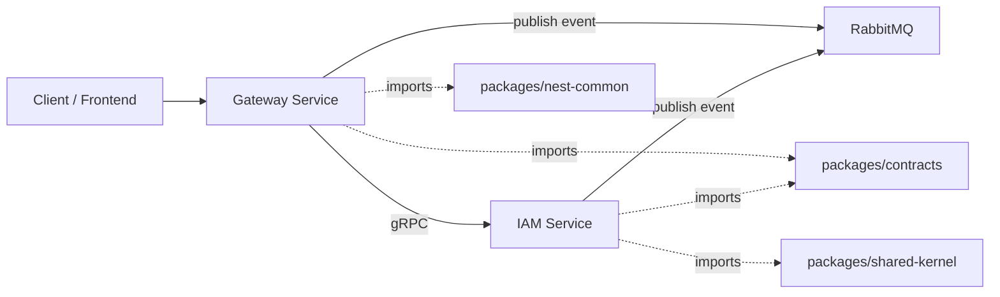

# System Architecture

## Mục tiêu tài liệu

Tài liệu này mô tả các thành phần kiến trúc chính của `CareerHub-be-microservices`, phân biệt rõ:

- phần đã thể hiện trong codebase hiện tại
- phần là định hướng kiến trúc cho các phase tiếp theo

Mục tiêu là giữ tài liệu trung thực với repo, đồng thời đủ rõ để team phát triển tiếp mà không lệch hướng.

## Đánh giá nhanh hiện trạng

| Thành phần | Trạng thái | Nhận xét |
| --- | --- | --- |
| Microservices Architecture | Đã có nền | Repo đã tách `services/gateway` và `services/iam-service`, kèm `packages/contracts`, `packages/shared-kernel`, `packages/nest-common`. |
| Clean Architecture | Đã có một phần | `gateway` đã tách `presentation`, `application`, `infrastructure`; `iam-service` hiện mạnh ở domain, chưa hoàn chỉnh application/infrastructure. |
| DDD | Đã có nền tốt | `iam-service` có aggregate, value object, domain event, domain error. |
| CQRS | Mới ở mức định hướng | Chưa thấy `CommandBus`, `QueryBus`, `CommandHandler`, `QueryHandler` runtime; nên ghi là kiến trúc mục tiêu, chưa phải trạng thái hoàn thiện. |
| Outbox Pattern | Đã có contract/interface | Có `OutboxRecord`, `OutboxRepository`, `IntegrationEventPublisher`, và tài liệu `docs/outbox-pattern.md`; chưa thấy triển khai persistence/worker thật. |
| Saga Pattern (Temporal) | Chưa thấy trong code | Nên mô tả như roadmap orchestration cho cross-service workflow, không nên ghi là đã triển khai. |
| Event-Driven Architecture | Đã có nền | Có `IntegrationEvent`, event contract cho gateway, RabbitMQ publisher/subscriber skeleton. |
| gRPC | Đã có nền | Có `iam.proto`, grpc client ở gateway, config runtime cho IAM. |
| RabbitMQ | Đã có nền | Có publisher/subscriber abstraction, routing key convention; chưa thấy kết nối/binding consumer hoàn chỉnh. |
| Observability | Có foundation nội bộ | `nest-common` đã có health endpoint và metrics endpoint dạng Prometheus text; chưa thấy OpenTelemetry, Loki, Tempo, Mimir, Promtail, Grafana trong repo. |
| CI/CD | Chưa thấy trong repo | Chưa thấy workflow/pipeline config. |
| Docker | Chưa thấy trong repo | Chưa thấy `Dockerfile` hay `docker-compose` trong thư mục này. |
| Kubernetes | Chưa thấy trong repo | Chưa thấy manifest/Helm chart/Kustomize. |

## Tổng quan kiến trúc

`CareerHub-be-microservices` nên được hiểu là một hệ backend theo hướng:

- mỗi service sở hữu một bounded context riêng
- giao tiếp sync qua gRPC khi cần request-response độ trễ thấp
- giao tiếp async qua RabbitMQ khi cần integration event
- domain logic được giữ trong domain/application layer
- contract dùng chung được đặt trong `packages/contracts`
- các concern hạ tầng dùng lại qua `packages/nest-common`

Mermaid tổng quan:



## Thành phần cốt lõi

### 1. Microservices Architecture

Repo hiện tại đã chia thành ba nhóm chính:

- `services/`: implementation của từng microservice
- `packages/contracts`: proto, integration event, outbox contract dùng chung
- `packages/shared-kernel`: primitive DDD dùng chung như aggregate root, value object, domain event
- `packages/nest-common`: bootstrap HTTP, logging, metrics, health, error mapping, request context

Ý nghĩa của cách chia này:

- service không phụ thuộc trực tiếp vào implementation của service khác
- phần dùng chung được gom vào package rõ ràng
- contract giữa các service được version hóa và import tập trung

### 2. Clean Architecture

Mục tiêu của Clean Architecture trong dự án này là tách:

- `presentation`: HTTP/gRPC/RPC entrypoint
- `application`: use case, orchestration, command/query handler
- `domain`: business rule cốt lõi
- `infrastructure`: adapter cho DB, broker, gRPC client, cache, external service

Trong `gateway`, cấu trúc này đã lộ rõ:

- `presentation/http/gateway.controller.ts`
- `application/gateway.service.ts`
- `infrastructure/messaging/rabbitmq/...`
- `infrastructure/transport/grpc/...`

Trong `iam-service`, phần mạnh nhất hiện tại là `domain/`, phù hợp cho bước xây domain model trước rồi mới ghép application và infrastructure.

### 3. DDD

DDD hiện là phần rõ nhất trong `iam-service`:

- aggregate: `Identity`
- value objects: `Email`, `Role`, `PasswordHash`, `IdentityStatus`
- domain errors: `InvalidIdentityStateError`, `IdentityDisabledError`, `InvalidRoleError`

Vai trò của DDD trong dự án:

- giữ business rule nằm trong domain thay vì rải vào controller/service
- biến state transition thành hành vi có kiểm soát

Ví dụ `Identity` aggregate:

- `register()` tạo identity ở trạng thái `pending_profile`
- `enable()` kích hoạt identity sang `active`
- `changeRole()` đổi role
- `disable()` đổi trạng thái sang `disabled`

> Lưu ý: hiện `Identity` chưa phát domain event nào. Các integration event `iam.user.registered.v1`, `iam.identity.role_changed.v1`, `iam.identity.disabled.v1` đã được gỡ bỏ vì không có consumer; activate identity chạy đồng bộ qua gRPC và chỉ cập nhật state.

### 4. CQRS

CQRS nên được dùng theo hướng:

- command xử lý thay đổi state
- query chỉ đọc dữ liệu và không sinh side effect

Luồng khuyến nghị:

```text
Controller
  -> CommandBus / QueryBus
  -> CommandHandler / QueryHandler
  -> Use Case
  -> Port Interface
  -> Infrastructure Adapter
```

Hoặc nếu chưa dùng bus runtime ngay:

```text
Controller
  -> Application Use Case
  -> Port Interface
  -> Adapter
```

Đánh giá theo repo hiện tại:

- ý tưởng CQRS phù hợp với kiến trúc bạn muốn
- nhưng hiện chưa thấy implementation `CommandBus`, `QueryBus`, `CommandHandler`, `QueryHandler`
- vì vậy docs nên mô tả đây là hướng chuẩn cho phase tiếp theo, không nên ghi là capability đã hoàn thiện

### 5. Event-Driven Architecture

Event-driven architecture dùng cho các tình huống:

- đồng bộ hóa dữ liệu giữa service
- phát side effect không chặn luồng chính
- giảm coupling giữa producer và consumer

Trong repo hiện tại đã có:

- `IntegrationEvent<TPayload>`
- event contract `gateway.cache.invalidated.v1`
- RabbitMQ publisher/subscriber skeleton ở `gateway`

Phân biệt hai loại event:

- domain event: nội bộ domain (hiện `iam-service` chưa phát domain event nào)
- integration event: dùng để giao tiếp giữa service, ví dụ `GatewayCacheInvalidatedEvent`

Đây là lý do `events/gateway` nằm trong `packages/contracts`:

- đó là contract liên service
- service khác có thể cần publish hoặc consume event này
- shape của event phải thống nhất toàn hệ thống

### 6. gRPC

gRPC nên là kênh sync nội bộ giữa các service khi cần:

- hiệu năng tốt
- contract rõ ràng qua `.proto`
- phù hợp cho request-response như auth validation, profile lookup, permission check

Trong repo hiện tại:

- `packages/contracts/src/grpc/iam.proto` định nghĩa `IamService`
- `gateway` có grpc client loader và runtime config để gọi IAM

Use case điển hình:

- Gateway nhận access token từ client
- Gateway gọi IAM qua gRPC `ValidateAccessToken`
- IAM trả về `valid`, `user_id`, `role`

### 7. RabbitMQ

RabbitMQ là kênh async chính cho integration event.

Vai trò:

- tách producer khỏi consumer
- hỗ trợ eventual consistency
- giúp service publish event mà không cần biết cụ thể ai đang nghe

Trong repo hiện tại, `GatewayRabbitMqPublisher` đang xây:

- `routingKey`
- `headers`
- message payload

Naming convention hiện có:

- service context: ví dụ `gateway`
- aggregate context: ví dụ `cache`
- event name: ví dụ `gateway.cache.invalidated.v1`

Điều này nên được chuẩn hóa thành rule chung cho toàn hệ thống để routing, tracing và monitoring nhất quán.

### 8. Outbox Pattern

Outbox pattern được dùng khi service:

- có database transaction
- cần đảm bảo không mất event sau khi commit dữ liệu

Luồng chuẩn:

1. Application xử lý command và thay đổi aggregate
2. Cùng transaction, service lưu thêm một `outbox record`
3. Worker/poller đọc các bản ghi `pending`
4. Worker publish integration event ra RabbitMQ
5. Nếu thành công, record chuyển `processed`
6. Nếu lỗi, tăng `retryCount` và retry theo policy

Repo hiện tại đã có nền:

- `OutboxRecord`
- `OutboxRepository`
- `IntegrationEventPublisher`
- tài liệu `docs/outbox-pattern.md`

Nhưng chưa có:

- bảng DB cụ thể
- worker/poller thật
- idempotency/retry/dead-letter policy hoàn chỉnh

Vì vậy docs nên mô tả outbox là pattern chuẩn bắt buộc cho các service có DB, còn `gateway` chỉ đang giữ contract/interface tham chiếu.

### 9. Saga Pattern với Temporal

Saga nên dùng cho workflow dài, nhiều bước, nhiều service, ví dụ:

- đăng ký tài khoản + tạo hồ sơ + gửi email + gán role mặc định
- ứng tuyển việc làm + kiểm tra quyền + tạo timeline + gửi notification

Nếu dùng Temporal:

- Temporal workflow đóng vai trò orchestrator
- activity gọi từng service hoặc publish command/event
- retry, timeout, compensation được quản lý rõ hơn

Đánh giá hiện tại:

- đây là hướng kiến trúc phù hợp
- nhưng repo chưa có Temporal SDK, workflow, activity, worker
- docs nên ghi là `target architecture`, chưa phải `current implementation`

### 10. Observability

Observability mục tiêu nên gồm:

- metrics: Prometheus
- logs: Promtail -> Loki
- traces: OpenTelemetry -> Tempo
- long-term metrics storage: Mimir
- dashboards: Grafana

Repo hiện tại mới thấy foundation ở `packages/nest-common`:

- HTTP health endpoints
- metrics endpoint ở format Prometheus text
- request-id propagation helpers cho HTTP, gRPC, RabbitMQ

Nghĩa là hiện trạng phù hợp để mở rộng sang observability đầy đủ, nhưng chưa nên ghi là stack đã được triển khai trọn bộ.

Khuyến nghị mô tả:

- `Current`: health, metrics endpoint, request correlation
- `Target`: OTel instrumentation, centralized logs, distributed tracing, dashboarding

### 11. CI/CD

Trong kiến trúc mục tiêu, CI/CD nên chịu trách nhiệm:

- lint, type-check, unit test
- build shared packages trước service packages
- build image cho từng service
- scan security/dependency
- deploy theo môi trường

Tuy nhiên repo hiện chưa thấy pipeline config. Vì vậy docs nên để phần này như tiêu chuẩn triển khai mong muốn, không gắn mác “đã có”.

### 12. Docker và Kubernetes

Docker nên dùng để:

- đóng gói từng service
- dựng môi trường local với broker, database, observability stack

Kubernetes nên dùng để:

- chạy service theo namespace/môi trường
- autoscaling
- config/secret management
- liveness/readiness probe
- service discovery

Repo hiện chưa có Docker/K8s manifest, nhưng `nest-common` đã có sẵn health endpoint, khá phù hợp để chuẩn bị cho readiness/liveness probe sau này.

## Mẫu luồng xử lý chuẩn theo component

### Luồng command có side effect

```text
HTTP/gRPC Controller
  -> CommandBus hoặc Application Use Case
  -> CommandHandler
  -> Aggregate / Domain Logic
  -> Repository transaction
  -> Outbox write
  -> Commit
  -> Outbox worker publish RabbitMQ event
```

### Luồng query chỉ đọc

```text
HTTP/gRPC Controller
  -> QueryBus hoặc Query Use Case
  -> Read adapter / read model
  -> Response DTO
```

### Luồng gateway gọi service nội bộ

```text
Client
  -> Gateway HTTP endpoint
  -> Gateway application layer
  -> gRPC client
  -> IAM service
  -> Gateway response
```

## Quy ước phân lớp khuyến nghị

### Application layer

Nơi đặt:

- command/query handler
- use case
- orchestration
- port interface

Không nên đặt ở đây:

- business invariant sâu của domain
- chi tiết hạ tầng như SQL, amqp client, grpc setup

### Domain layer

Nơi đặt:

- aggregate
- entity
- value object
- domain service
- domain event
- domain error

### Infrastructure layer

Nơi đặt:

- repository adapter
- RabbitMQ publisher/consumer
- gRPC client/server adapter
- cache adapter
- ORM/DB implementation

### Presentation layer

Nơi đặt:

- controller
- DTO mapping
- request/response boundary
- transport-specific concerns

## Khuyến nghị viết docs cho dự án

Để tài liệu nhất quán và không “nói quá” so với codebase, nên dùng hai nhãn trong mọi tài liệu kiến trúc:

- `Current implementation`
- `Target architecture`

Ví dụ:

- `DDD`: current implementation
- `gRPC`: current foundation
- `RabbitMQ`: current foundation
- `Outbox`: partial foundation
- `CQRS`: target architecture
- `Saga/Temporal`: target architecture
- `OpenTelemetry + LGTM stack`: target architecture
- `CI/CD`, `Docker`, `Kubernetes`: target architecture

## Kết luận

`CareerHub-be-microservices` hiện có nền kiến trúc khá đúng hướng:

- chia service và shared package hợp lý
- domain model IAM tốt cho DDD
- có contract cho gRPC, integration event và outbox
- có foundation cho health, metrics và request correlation

Điểm quan trọng nhất khi viết docs là:

- mô tả rõ cái gì đã có trong repo
- tách riêng cái gì là đích kiến trúc
- dùng component docs để dẫn đường implementation, không biến docs thành danh sách công nghệ gắn vào cho đủ

Nếu follow hướng này, bộ docs sẽ vừa đáng tin, vừa đủ mạnh để team mở rộng sang CQRS đầy đủ, outbox runtime, Temporal saga, và observability stack sau này.
